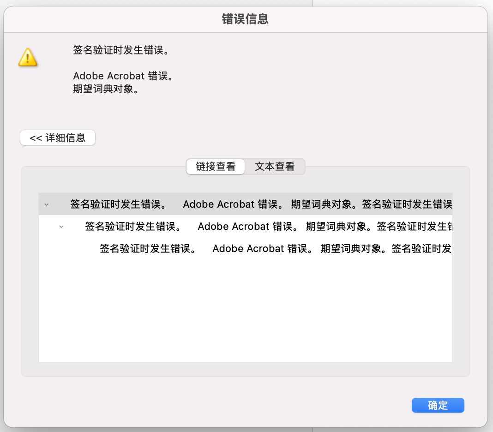
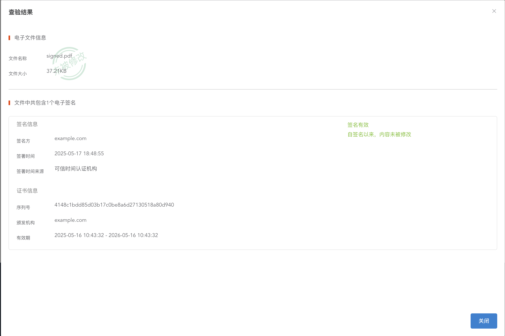

# Example
```shell
# verify 部分只验证了签名信息有效，没有验证证书是否被信任。

# 骑缝章
cargo r -- sign -i files/hello_world.pdf --cross-page-image files/seal.png

# 不可见数字签名
cargo r -- sign -i files/hello_world.pdf -c certs/mycert.p12 
cargo r -- verify -i output/signed.pdf

# 可见数字签名 带印章
cargo r -- sign -i files/hello_world.pdf -c certs/mycert.p12 --image files/seal.png
cargo r -- verify -i output/signed.pdf

# 骑缝章 + 可见数字签名
cargo r -- sign -i files/hello_world.pdf -c certs/mycert.p12 --image files/seal.png --cross-page-image files/seal.png
cargo r -- verify -i output/signed.pdf
```

# 仍然存在的问题
不可见数字签名能够正常的被 Adobe Acrobat Reader 识别并验证。
但是可见签名在 Adobe Acrobat Reader 无法识别，并且会出现以下报错



但是其他的一些签名验证网站，以及命令行工具验证的结果都是正常的



猜测可能是 Adobe Acrobat Reader 对 PDF 文档结构有更加严格的限制，但是它给出的报错信息太过笼统，难以定位，目前还没有找到一个合适的解决方案